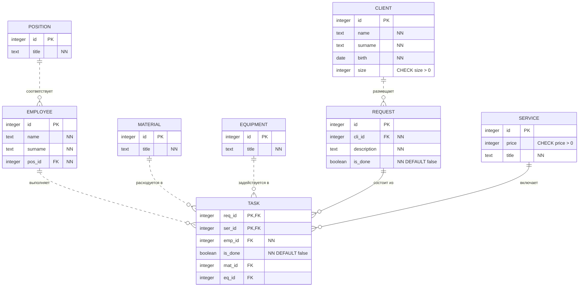

# Универсальная даталогическая модель

```mermaid
%%{init: { 'theme': 'default' } }%%
erDiagram
    CLIENT {
        integer id PK
        text name "NN"
        text surname "NN"
        date birth "NN"
        integer size "CHECK size > 0"
    }

    POSITION {
        integer id PK
        text title "NN"
    }

    EMPLOYEE {
        integer id PK
        text name "NN"
        text surname "NN"
        integer pos_id FK "NN"
    }

    SERVICE {
        integer id PK
        integer price "CHECK price > 0"
        text title "NN"
    }

    MATERIAL {
        integer id PK
        text title "NN"
    }

    EQUIPMENT {
        integer id PK
        text title "NN"
    }

    REQUEST {
        integer id PK
        integer cli_id FK "NN"
        text description "NN"
        boolean is_done "NN DEFAULT false"
    }

    TASK {
        integer req_id PK,FK
        integer ser_id PK,FK
        integer emp_id FK "NN"
        boolean is_done "NN DEFAULT false"
        integer mat_id FK
        integer eq_id FK
    }

    CLIENT ||..o{ REQUEST : "размещает"
    POSITION ||..o{ EMPLOYEE : "соответствует"
    EMPLOYEE ||..o{ TASK : "выполняет"
    MATERIAL ||..o{ TASK : "расходуется в"
    EQUIPMENT ||..o{ TASK : "задействуется в"
    REQUEST ||--o{ TASK : "состоит из"
    SERVICE ||--o{ TASK : "включает"
```