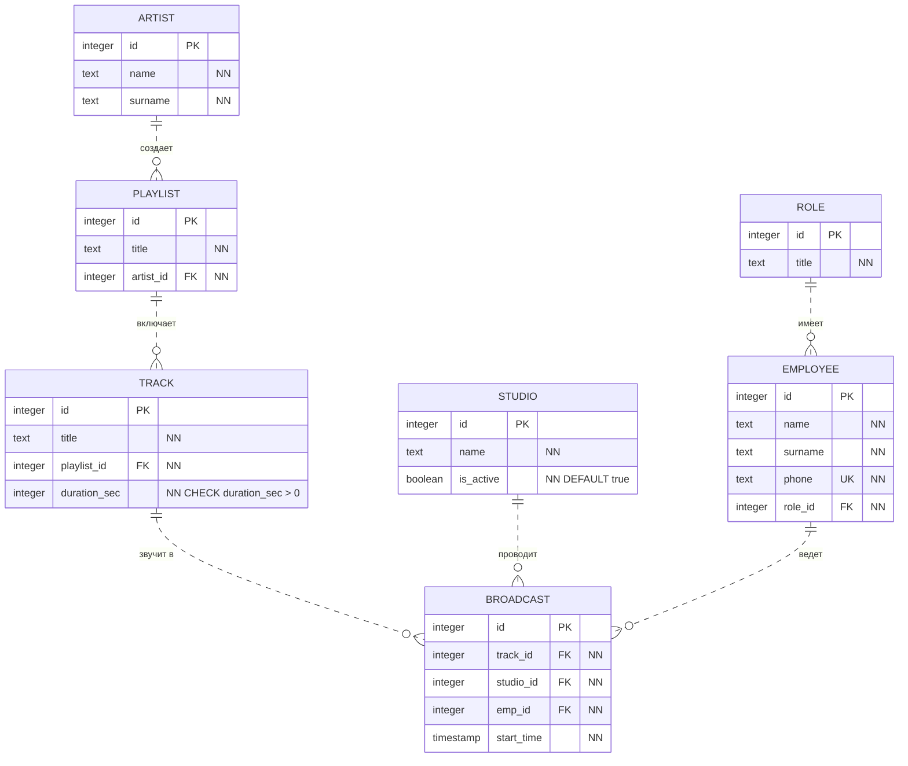
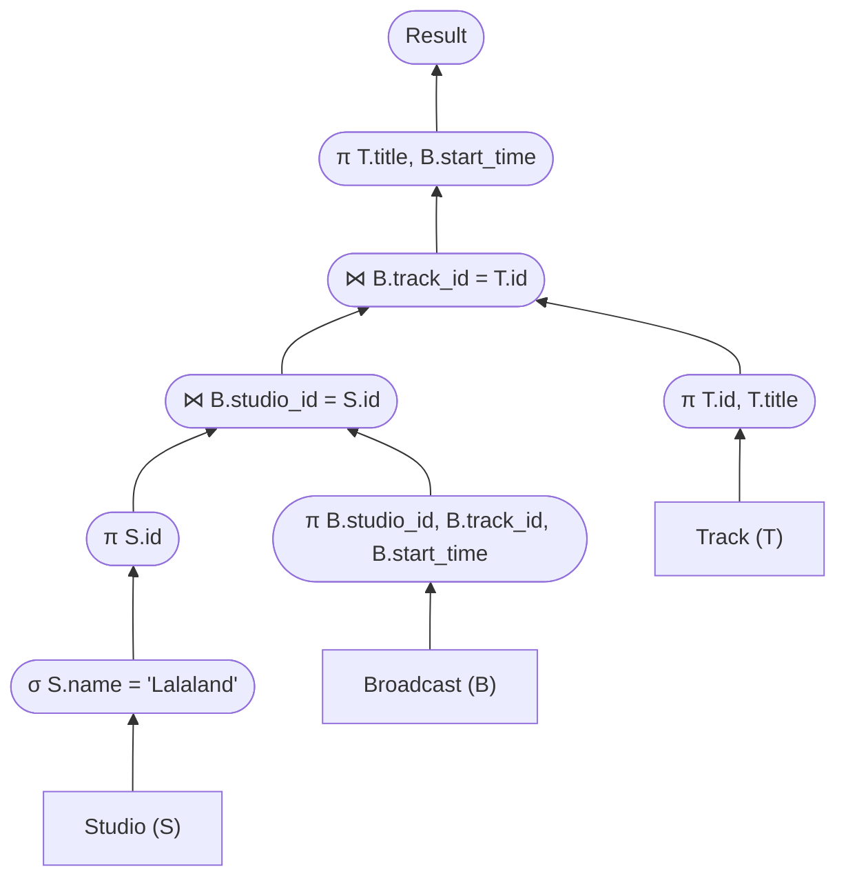

# Радиостанция
## 1. Даталогическая модель

**Список сущностей:**
1. **ROLE** — Роль/Должность сотрудника.
2. **EMPLOYEE** — Сотрудник (ведущий, звукорежиссер).
3. **STUDIO** — Студия вещания.
4. **ARTIST** — Исполнитель/Музыкант.
5. **PLAYLIST** — Плейлист (или музыкальный альбом исполнителя).
6. **TRACK** — Музыкальный трек.
7. **BROADCAST** — Эфир/Трансляция (Таблица-связка).

**Реализация связи Многие-ко-Многим (N:M):**
Oдин и тот же музыкальный трек (`TRACK`) может звучать во множестве различных эфиров, а сами эфиры могут проходить в разных студиях (`STUDIO`). Для разрешения этой связи `N:M` вводится сущность "эфир" (`BROADCAST`).



## 2. Триггеры

### Предложение триггера

Предположим, что необходимо ввести правило: нельзя выпустить трек в эфир из студии, которая в данный момент не работает (что наверное логично).

Создадим триггер:
```SQL
CREATE OR REPLACE FUNCTION check_studio_active() 
RETURNS trigger AS $$
DECLARE
    v_is_active boolean;
BEGIN
    SELECT is_active INTO v_is_active 
    FROM STUDIO 
    WHERE id = NEW.studio_id;
    
    IF v_is_active = false THEN
        RAISE EXCEPTION 'Нельзя выпустить трек в эфир: студия неактивна!';
    END IF;
    
    RETURN NEW;
END;
$$ LANGUAGE plpgsql;
```

Воспользуемся им:
```SQL
CREATE TRIGGER trg_check_studio
BEFORE INSERT ON BROADCAST
FOR EACH ROW EXECUTE FUNCTION check_studio_active();
```

### Виды триггеров

Триггеры делятся по разным критериям:
1. По уровню срабатывания:
   * *Строковые* (`FOR EACH ROW`) — выполняются для каждой измененной строки.
   * *Табличные* (`FOR EACH STATEMENT`) — выполняются один раз для всей SQL-команды, независимо от числа затронутых строк.
2. По времени срабатывания:
   * `BEFORE` — до выполнения операции.
   * `AFTER` — после выполнения операции.
   * `INSTEAD OF` — триггеры замещения (применяются только для представлений/VIEW).
3. По перехватываемому событию:
   * *DML-триггеры* (`INSERT`, `UPDATE`, `DELETE`).
   * *DDL-триггеры* (`CREATE`, `ALTER`, `DROP`).

## 3. Запрос с `INNER JOIN`


Предположим, что нам нужно узнать названия музыкальных треков и время их запуска для всех эфиров, которые проводились в студии под названием 'Lalaland'.

```SQL
SELECT T.title AS track_title, B.start_time 
FROM BROADCAST B
INNER JOIN TRACK T ON T.id = B.track_id
INNER JOIN STUDIO S ON S.id = B.studio_id
WHERE S.name = 'Lalaland';
```

## 4. План выполнения запроса

Перед выполнением запроса создадим индекс на ID студии в таблице трансляций, так как мы производим поиск по строгому равенству:

```SQL
CREATE INDEX idx_broadcast_studio ON BROADCAST USING hash(studio_id);
```

Эффективный логический план выполнения запроса:



### Обоснование выбора плана:
1. **Ранняя выборка ($\sigma$):** Выборка студии по названию `Lalaland` выполняется в самом начале. Это сокращает количество строк до абсолютного минимума, что максимально снижает нагрузку на все последующие шаги.
2. **Проталкивание проекций ($\pi$):** Все проекции протолкнуты «до дна» (выполняются сразу после чтения базовых таблиц). Это позволяет отбросить ненужные столбцы (например, название студии после фильтрации) и соединять только узкие строки, экономя оперативную память.
3. **Эффективный алгоритм соединения:** Благодаря малому количеству строк используется алгоритм `Index Nested Loop Join`. Он производит соединение на основе автоматических индексов первичных ключей родительских таблиц, исключая необходимость тяжелой сортировки или хэширования.
4. **Конвейерная обработка:** План построен в виде левостороннего дерева, что обеспечивает поточное движение данных снизу вверх без создания временных таблиц в памяти.