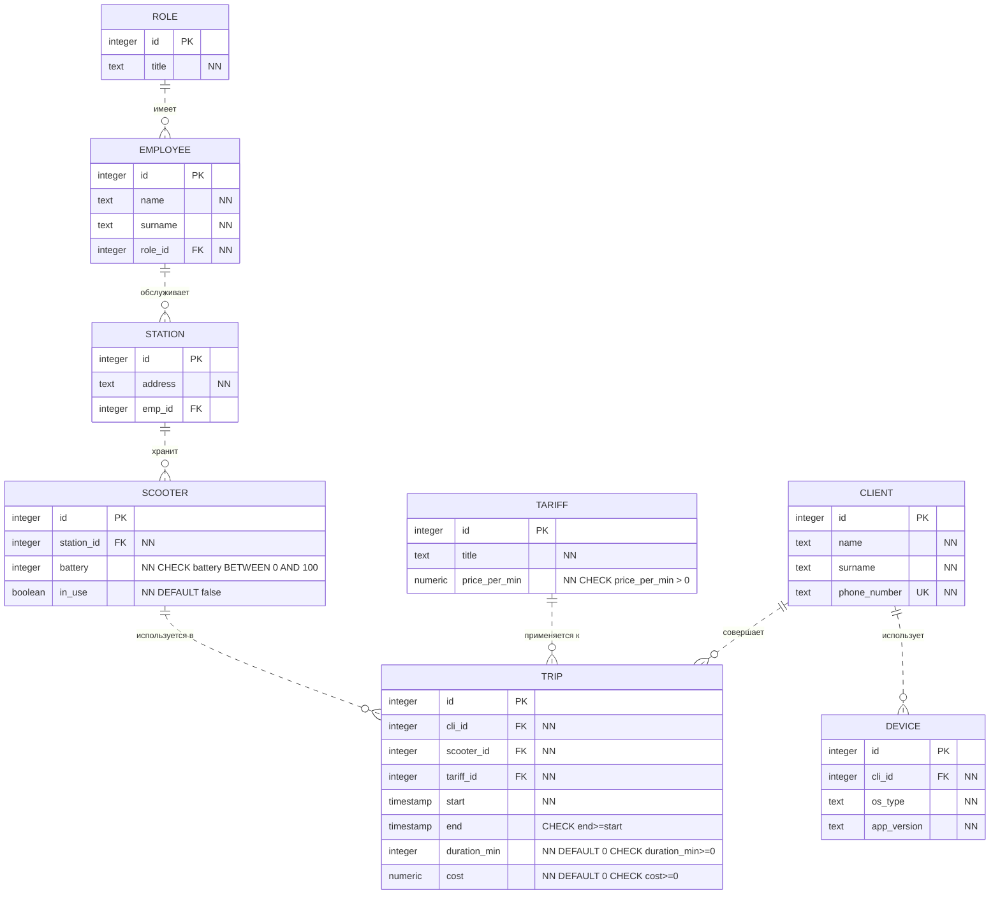
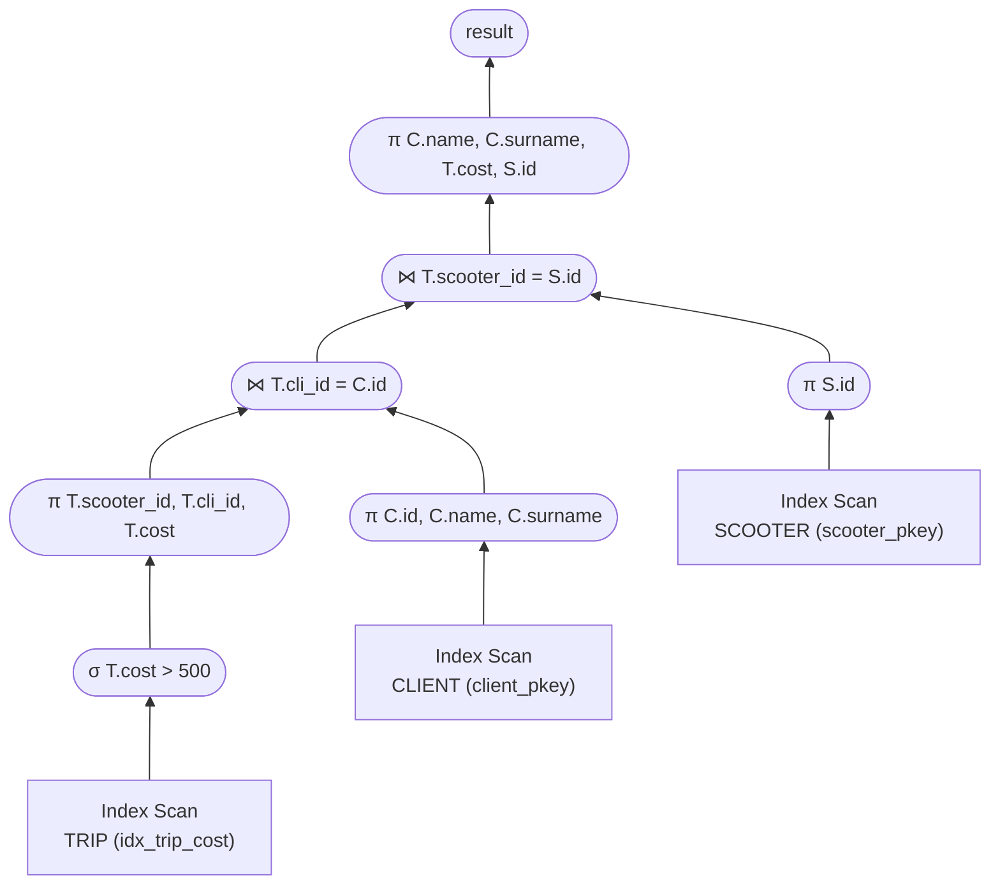

# Сервис по аренде самокатов

## 1. Даталогическая модель

**Список сущностей:**
1. **ROLE** — Роль/Должность сотрудника.
2. **EMPLOYEE** — Сотрудник (техник, менеджер).
3. **STATION** — Парковка/Станция.
4. **SCOOTER** — Самокат.
5. **CLIENT** — Клиент.
6. **DEVICE** — Устройство (смартфон клиента).
7. **TARIFF** — Тариф (стоимость аренды).
8. **TRIP** — Поездка (Таблица-связка).

**Реализация связи Многие-ко-Многим (`N:M`):**
Один и тот же клиент (`CLIENT`) за всё время пользования сервисом может совершить множество поездок на самых разных самокатах. И наоборот — один конкретный самокат (`SCOOTER`) за время своей эксплуатации используется в поездках множеством различных клиентов. Сущность `TRIP` (Поездка) разрешает эту связь `N:M`, объединяя клиента, выбранный самокат и примененный тариф в единую запись транзакции.



## 2. Триггеры

### Предложение триггера

Предположим, что необходимо ввести правило: нельзя брать в аренду самокат, у которого заряд менее 10% или который уже используется.

Создадим триггер:
``` SQL
CREATE OR REPLACE FUNCTION check_scooter_status() 
RETURNS trigger AS $$
DECLARE
    scooter_battery integer;
    scooter_is_used boolean;
BEGIN
    SELECT battery, in_use INTO scooter_battery, scooter_is_used
    FROM SCOOTER
    WHERE id = NEW.scooter_id;
    IF scooter_battery < 10 THEN
        RAISE EXCEPTION 'Самокат разряжен! Уровень заряда: %', scooter_battery;
    END IF;
    IF scooter_is_used = true THEN
        RAISE EXCEPTION 'Данный самокат уже находится в аренде!';
    END IF;
    RETURN NEW;
END;
$$ LANGUAGE plpgsql;
```
Воспользуемся им:
``` SQL
CREATE TRIGGER trg_check_scooter
BEFORE INSERT ON TRIP
FOR EACH ROW EXECUTE FUNCTION check_scooter_status();
```

### Виды триггеров

Триггеры делятся по разным критериям:
1. По уровню срабатывания:
   * *Строковые* (`FOR EACH ROW`) — выполняются для каждой измененной строки.
   * *Табличные* (`FOR EACH STATEMENT`) — выполняются один раз для всей SQL-команды, независимо от числа затронутых строк.
2. По времени срабатывания:
   * `BEFORE` — до выполнения операции.
   * `AFTER` — после выполнения операции.
   * `INSTEAD OF` — триггеры замещения (применяются только для представлений/VIEW).
3. По перехватываемому событию:
   * *DML-триггеры* (`INSERT`, `UPDATE`, `DELETE`).
   * *DDL-триггеры* (`CREATE`, `ALTER`, `DROP`).

## 3. Запрос с `INNER JOIN`

Предположим, что нам нужно знать, кто из клиентов имел поездки за более, чем 500 рублей.

``` SQL
SELECT C.name, C.surname, T.cost, S.id FROM TRIP T
INNER JOIN CLIENT C ON C.id = T.cli_id
INNER JOIN SCOOTER S ON S.id = T.scooter_id
WHERE T.cost > 500;
```

## 4. План выполнения запроса

Перед выполнением запроса создадим индекс на `cost` в `TRIP`:

```SQL
CREATE INDEX idx_trip_cost ON TRIP USING btree(cost);
```

Теперь эффективный план будет такой (использовался алгоритм `Index Nested Loop Join`):


