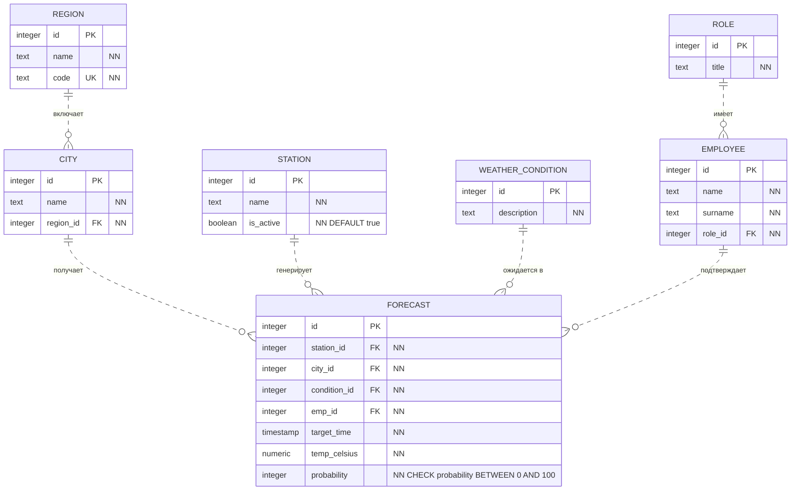
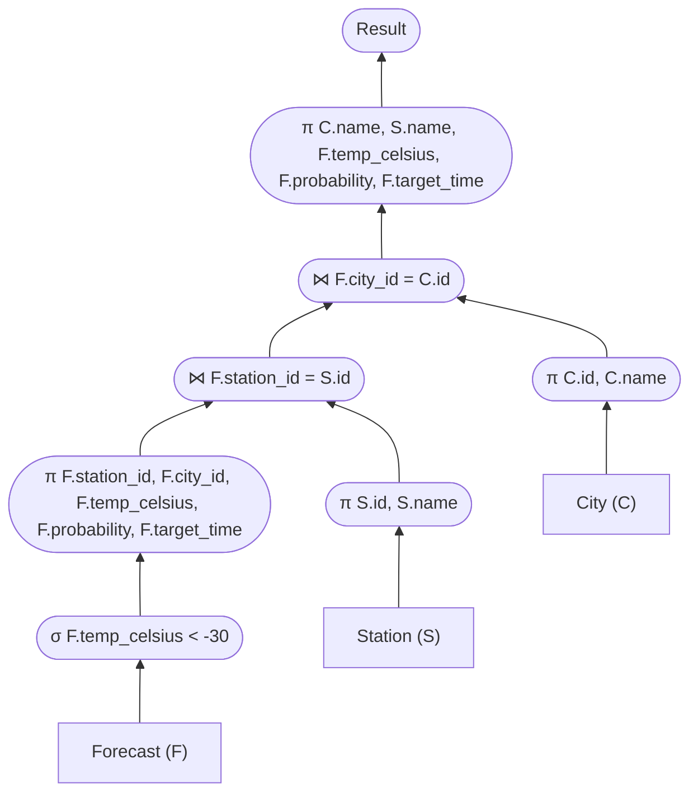

# Прогнозирование погоды
## 1. Даталогическая модель

### Сущности предметной области и связь `N:M`
1. **ROLE** — Должность сотрудника.
2. **EMPLOYEE** — Сотрудник (метеоролог, синоптик).
3. **REGION** — Регион/Область.
4. **CITY** — Населенный пункт (город).
5. **STATION** — Физическая метеостанция.
6. **WEATHER_CONDITION** — Погодные условия (ясно, дождь, снег).
7. **FORECAST** — Прогноз погоды (Таблица-связка).

**Реализация связи Многие-ко-Многим (`N:M`):**
В метеорологии одна крупная метеостанция (`STATION`) способна рассчитывать и предоставлять прогнозы погоды для нескольких близлежащих городов (`CITY`), и наоборот — один город может получать метеоданные от нескольких различных станций вокруг него. Таблица `FORECAST` разрешает эту связь `N:M` напрямую, связывая конкретный город и станцию в определенный момент времени.



## 2. Триггеры

### Предложение триггера

Предположим, что мы не хотим, чтобы в `FORECAST` можно было добавлять прогнозы по прошлому. Сделаем для этого следующий триггер:
``` SQL
CREATE OR REPLACE FUNCTION prevent_past_forecast_updates() 
RETURNS trigger AS $$
BEGIN
    IF NEW.target_time <= current_timestamp THEN
        RAISE EXCEPTION 'Прогноз нельзя давать на время, которое уже прошло!';
    END IF;
    RETURN NEW;
END;
$$ LANGUAGE plpgsql;

CREATE TRIGGER trg_prevent_past_updates
BEFORE INSERT OR UPDATE ON FORECAST
FOR EACH ROW EXECUTE FUNCTION prevent_past_forecast_updates();
```
### Виды триггеров

Триггеры делятся по разным критериям:
1. По уровню срабатывания:
   * *Строковые* (`FOR EACH ROW`) — выполняются для каждой измененной строки.
   * *Табличные* (`FOR EACH STATEMENT`) — выполняются один раз для всей SQL-команды, независимо от числа затронутых строк.
2. По времени срабатывания:
   * `BEFORE` — до выполнения операции.
   * `AFTER` — после выполнения операции.
   * `INSTEAD OF` — триггеры замещения (применяются только для представлений/VIEW).
3. По перехватываемому событию:
   * *DML-триггеры* (`INSERT`, `UPDATE`, `DELETE`).
   * *DDL-триггеры* (`CREATE`, `ALTER`, `DROP`).

## 3. Запрос с `INNER JOIN`

Предположим, нам нужно получить названия метеостанций, названия их городов, ожидавшуюся температуру, вероятность и время прогноза для всех случаев, в которых прогнозировались аномальные морозы (температура ниже -30 градусов) для этих станций:

```SQL
SELECT S.name AS station_name, C.name AS city_name, F.temp_celsius, F.probability, F.target_time
FROM FORECAST F
INNER JOIN STATION S ON S.id = F.station_id
INNER JOIN CITY C ON C.id = F.city_id
WHERE F.temp_celsius < -30;
```

## 4. План выполнения запроса

Перед выполнением запроса создадим B-tree индекс на столбец температуры, так как в запросе используется фильтрация по диапазону (`< -30`):

```SQL
CREATE INDEX idx_forecast_temp ON FORECAST USING btree(temp_celsius);
```

Эффективный план выполнения будет построен в виде левостороннего дерева (снизу вверх) с применением алгоритма `Index Nested Loop Join` для использования преимуществ индекса и конвейерной обработки:


**ВАЖНО:**
Тут будет использоваться именно `Index Nested Loop Join`. Почему?
#TODO объяснить + сделать в `README` рассказ про то, какие алгоритмы вообще есть (и воспользоваться конспектом Артёма the практика)